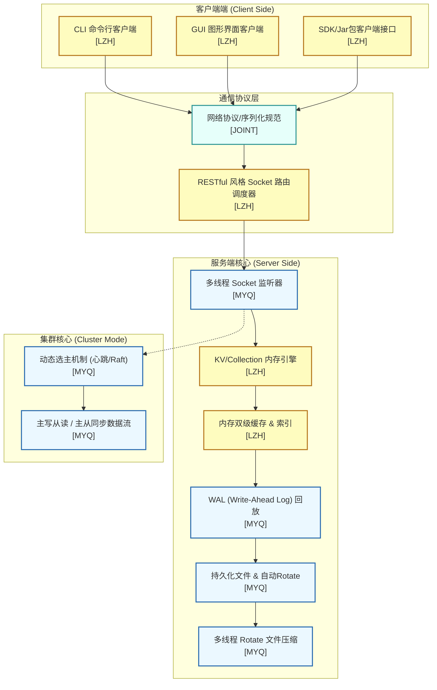
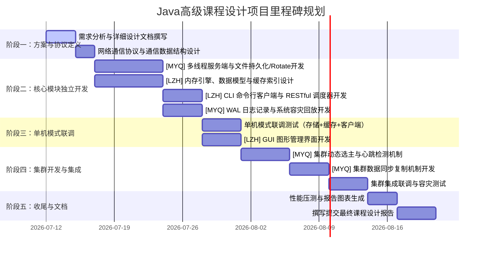

# Java高级课程设计任务分工文档
## ── 多线程C/S架构NoSQL数据库系统设计与实现

> **注意**：本文档基于《Java高级编程及应用考核内容指导书》要求制定。本项目为 **双人组队** 任务，要求系统采用 **Java 21** 开发，基于 **C/S架构** 并且支持 **多线程多客户端连接**，包含 **单机** 与 **集群**（动态选举角色）模式。

---

## 1. 项目定位与核心技术选型
- **宿主语言**：Java 21（利用其虚拟线程或标准多线程 API）
- **网络通信**：Java Socket / NIO，在 Socket 上实现自定义的轻量级协议（含类似 RESTful 路由调度器）
- **存储引擎**：基于 LSM-Tree（Log-Structured Merge-Tree）简化版或 Key-Value 结构，带 WAL (Write-Ahead Log) 回放
- **集群协作**：1主2从节点，利用 UDP/TCP 组播或心跳广播实现 **动态选举（Raft简化版）** 及数据主从同步
- **版本控制**：Git，要求每人使用独立的分支，保留详细提交日志以作评分佐证（Git Log 截图）

---

## 2. 架构设计与模块归属
以下是项目整体架构及模块划分。图中：
- **[MYQ]**：组长 **马奕钦** 负责模块
- **[LZH]**：组员 **黎展宏** 负责模块
- **[JOINT]**：**共同协作** 开发模块

---

## 3. 详细任务分工表

| 模块名称 | 核心功能点 | 负责人 | 难度指数 | 交付物及验证方法 |
| :--- | :--- | :---: | :---: | :--- |
| **A. 底层通信与服务端** | 1. 基于 Java 21 的多线程 Socket Server，支持多 Client 并发连接。 2. 与客户端通信的网络协议编解码器设计。 | **马奕钦** (组长) | ★★★★☆ | Server 主程序类，支持并发压测不掉线。 |
| **B. 存储引擎与持久化** | 1. 数据的磁盘序列化与持久化机制。 2. 磁盘文件大小监控与自动分卷机制 (Rotate)。 3. 多线程异步对 Rotate 后历史数据文件进行压缩 (GZIP/ZIP)。 | **马奕钦** (组长) | ★★★★★ | 持久化数据文件、多线程压缩任务类，可在磁盘上查看 `.zip`/`.gz` 压缩文件。 |
| **C. 数据一致性 & 容灾** | 1. 解决缓存与磁盘数据一致性问题。 2. 异常断电容灾：实现 WAL (预写日志) 的追加写入与启动自动回放重建内存。 | **马奕钦** (组长) | ★★★★★ | `WalLogger` 与回放模块。强行 Kill 服务进程后重启，数据能完整恢复。 |
| **D. 集群角色选举与同步** | 1. 3节点组网，使用心跳与网络广播实现 **动态选举 (组队必做)**。 2. 角色确定（1主2从，主写从读），主节点将写操作同步复制/异步复制到从节点。 | **马奕钦** (组长) | ★★★★★ | 集群启动类、选举状态机。控制台实时打印 Leader/Follower 状态，任意 Kill 主节点后，从节点能自动选举出新主。 |
| **E. 内存引擎与数据模型** | 1. 内存中 KV 及 Collection 模型的逻辑维护。 2. 拓展支持批量插入 (Bulk Put)、批量更新、批量删除。 3. 支持多样化 Value 类型（数值、字符串、List、Map 及自定义对象）。 | **黎展宏** (组员) | ★★★★☆ | Collection 数据结构定义，测试类中演示批量操作与复杂对象存取。 |
| **F. 查询优化与缓存** | 1. 数据双级缓存机制，遵循 LRU/LFU 淘汰算法。 2. 索引设计（Hash 索引/B+树索引），用以加速磁盘文件查询速度。 | **黎展宏** (组员) | ★★★★☆ | 缓存管理器、索引类。测试读取性能，有索引和缓存时的耗时降至毫秒级。 |
| **G. RESTful 调度与 API** | 1. 基于 Socket 实现类似 RESTful 风格的调度路由器。 2. 设计统一的 API 接口，并提供 Java SDK (封装成 Jar 包供第三方调用)。 | **黎展宏** (组员) | ★★★☆☆ | RESTful 调度器、Jar 客户端接口。编写第三方 Java 程序导入该 Jar 包并能正常请求。 |
| **H. 多端交互界面** | 1. 命令行客户端 (CLI Tool)，支持类似 Redis-cli 的交互命令。 2. 图形客户端 (GUI Client)，能直观展示 Collection 结构和 KV 增删改查。 | **黎展宏** (组员) | ★★★★☆ | CLI 执行程序，基于 JavaFX / Swing 编写的 GUI 桌面应用。 |

> **共同协作部分 (Joint Efforts)**:
> 1. **协议规范制订**：项目初期，双方必须共同制定并冻结《客户端-服务端网络通信协议规范》与《集群间通信包格式》。
> 2. **系统集成联调**：单机模式和集群模式的最终对接，双方共同协作，解决数据同步和客户端网络重连的问题。
> 3. **系统性能测试**：共同编写基准测试脚本，对数据库读写性能进行压测，并输出测试图表。

---

## 4. 里程碑与进度规划

---

## 5. Git 协作与项目规范

> **注意**：根据指导书评分标准，**Git Log 提交记录是各小组分工与实现的有效证明之一**。必须严格执行以下版本管理规范。

### 5.1 分支策略
- **`main` 分支**：主分支，仅保留稳定、可部署的版本。严禁在此分支直接提交代码。
- **`dev` 分支**：开发集成分支，用于两人代码的阶段性合并与联调。
- **功能分支**：
  - 马奕钦的分支：`feature/mayiqin-core` (核心引擎)、`feature/mayiqin-cluster` (集群)
  - 黎展宏的分支：`feature/lizhanhong-engine` (内存结构)、`feature/lizhanhong-client` (多端交互)

### 5.2 Commit 提交规范
Commit 信息必须清晰直观，格式如下：
`[模块名称] 动作: 变更描述简述`
- 示例：`[WAL] feat: 新增WAL日志自动回放重建内存功能`
- 示例：`[Cache] fix: 修复LRU缓存在高并发下的线程安全问题`

---

## 6. 报告撰写与佐证材料准备

根据课程设计评分标准，每位小组成员需**独立提交一份课程设计报告**，必须包含以下要素：

1. **基本大纲要件**：
   - 封面（使用指导书附件格式）、任务书、成绩评定表、目录、正文、总结、参考资料、附录。
2. **正文分工描述**：
   - 在报告的“分工描述”章节，必须严格与本《任务分工文档》吻合，突出个人的开发职责。
3. **佐证材料（附录）**：
   - **小组研讨记录**：讨论照片、线上腾讯会议截图、讨论记录等。
   - **Git 提交佐证**：附上各自功能分支的 `git log` 截图，证明个人的开发历程和真实工作量。
   - **核心代码分析**：针对个人负责的特色模块（如马奕钦的多线程压缩、WAL 回放；黎展宏的双级缓存、GUI 界面）进行深度解析。
